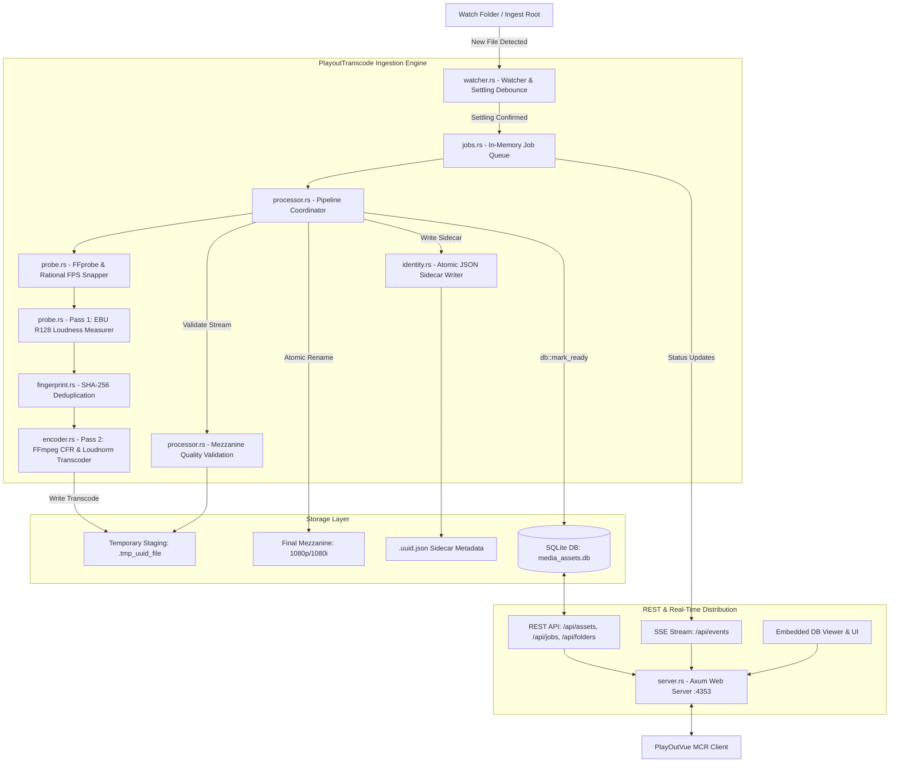

# PlayoutTranscode

[](https://github.com/Soranokuni)
[](https://opensource.org/licenses/MIT)
[](https://www.rust-lang.org/)
[](https://github.com/tokio-rs/axum)
[](https://ffmpeg.org/)
[](https://www.sqlite.org/)

**PlayoutTranscode** is an automated, broadcast-grade media ingestion, analysis, and mezzanine transcoding engine developed by **Alex Fountas** ([Soranokuni](https://github.com/Soranokuni)). Engineered in **Rust** as a resilient Windows service daemon, it monitors watch folders, performs rational FPS snapping, normalizes audio to **EBU R128 / ATSC A/85** loudness standards, transcodes incoming media into standardized frame-accurate mezzanine streams (Profiles A/B/C), writes JSON identity sidecars, and exposes a high-performance REST and Server-Sent Events (SSE) API to downstream clients like **[PlayOutVue](https://github.com/Soranokuni/PlayOutVue)**.

---

## Architecture & Ingest Pipeline

The pipeline guarantees zero partial-read hazards through atomic `.tmp` staging, strict FFprobe validation, two-pass loudness normalization, and deferred database publication.



---

## Core Ingestion Features

1. **Active Settling & Debounce**: Detects file writes across network and local filesystems, applying file-settling heuristics to avoid reading partial files during copy operations.
2. **Rational FPS Snapping**: Snaps probed frame rates to exact broadcast rationals (e.g. `25/1`, `30000/1001`, `24000/1001`, `60000/1001`) instead of lossy float approximations.
3. **EBU R128 & ATSC A/85 Audio Normalization**: Automated two-pass loudness analysis and dynamic linear correction targeting statutory broadcast levels (-23 LUFS / -24 LUFS) with ITU-R BS.775 downmixing.
4. **Deterministic Transcoding**: Uses `libx264`, constant frame rate (CFR), 2.0-second closed GOPs, faststart `moov` atom placement, and 48 kHz stereo audio resampling.
5. **Zero Partial-Read Staging**: Encodes media directly into temporary files (`.tmp_{uuid}_{filename}`) on the target volume and atomically renames them only after complete validation.
6. **Mezzanine Contract Enforcement**: Never calls `db::mark_ready` until duration, closed GOP, audio rate, faststart header, and sidecar JSON are verified.
7. **Soft-Delete Recycle Bin & Reference Checking**: Allows soft-deleting media into a recycle bin, preventing physical deletion of assets that are actively scheduled in broadcast rundowns.
8. **Process Priority & Concurrency Throttling**: Limits simultaneous FFmpeg processes and sets OS thread priorities to `Below-Normal` to ensure playout machines remain responsive.

---

## Audio Loudness Normalization Engine

PlayoutTranscode provides professional, broadcast-standard audio normalization to eliminate loudness jumps between commercials, live shows, and legacy content:

### 1. Supported Loudness Standards
- **EBU R128 (European Broadcast Standard)**:
  - Integrated Loudness: **`-23.0 LUFS`** (configurable)
  - Maximum True Peak: **`-1.0 dBTP`**
  - Loudness Range (LRA): **`7.0 LU`**
- **ATSC A/85 (US / North American Standard)**:
  - Integrated Loudness: **`-24.0 LUFS`** (configurable)
  - Maximum True Peak: **`-2.0 dBTP`**
  - Loudness Range (LRA): **`11.0 LU`**
- **Legacy / Custom Mode** (`legacy_v1_encode`): no loudness processing; resampled to 48 kHz stereo with configurable bitrates (`aac`, `pcm_s16le`, `libmp3lame`). Kept only where a config names it explicitly.
- **Measure only** (`passthrough_validate`, `analyze_only`): the source is measured and the result recorded in the sidecar, but the level is not changed.

**Default: EBU R128** (-23 LUFS, -1 dBTP). With no `[audio_policy]` section, or one that omits `mode`, the service normalises; before this change it applied no loudness processing at all.

### 2. Two-Pass Measurement & Correction
- **Pass 1 (Analysis)**: `RealLoudnessMeasurer` (`probe.rs`) runs FFmpeg with the `loudnorm` filter in JSON output mode, extracting exact `input_i`, `input_tp`, `input_lra`, and `input_thresh`.
- **Pass 2 (Correction)**: `profiles.rs` injects the measured values into the encoding filterchain (`measured_I`, `measured_TP`, `measured_LRA`, `measured_thresh`, `offset`, `linear`). Linear (one static gain, no pumping) is requested whenever that gain keeps the projected true peak under target; otherwise loudnorm runs dynamically.
- **QC re-measure**: the encoded track is measured again; more than +/-1 LU off target, or a true peak more than 0.5 dB over it, fails QC (`output_loudness_off_target`, `output_true_peak_exceeded`).
- **Timing**: every path (AAC, PCM, MP3) resamples with `aresample=async=1:min_hard_comp=0.1:first_pts=0` to 48 kHz -- libsoxr when the ffmpeg build has it, swr otherwise.

### 3. Channel Mapping & ITU-R BS.775 Downmix
- **Several mono tracks (MXF / XDCAM)**: tracks 1 and 2 are joined into L/R. `dual_mono = true` instead plays track 1 on both channels.
- **Mono (1.0) $\rightarrow$ Dual Mono / Stereo**: `pan=stereo|c0=c0|c1=c0`
- **Known multichannel layouts** (3.0, quad, 5.0, 5.1, 6.1, 7.1, ...): matrix downmix, centre and surrounds at -3 dB, LFE dropped, normalised so neither side clips. 5.1:
  ```text
  pan=stereo|FL=0.4142*c0+0.2929*c2+0.2929*c4|FR=0.4142*c1+0.2929*c2+0.2929*c5
  ```
- **Unknown / discrete layouts** (any channel count): channels 1 and 2 are the programme, `pan=stereo|c0=c0|c1=c1`. No channel count fails a job.
- **Passthrough Mode**: Set `preserve_original = true` to preserve source multi-channel audio tracks.

---

## Broadcast Encoding Profiles

PlayoutTranscode provides three standard broadcast profiles configurable in `config.toml`:

The CasparCG channel is 1080i50, so the profile is chosen by how much motion the source carries (field rate for interlaced, frame rate for progressive -- after an `idet` pass over real frames, not the container flag alone):

| Profile | Chosen for | Output | Picture path |
|---|---|---|---|
| **Profile A** | HD progressive <= 30 fps (25p, 24p, 29.97p, UHD 30p) | 1080p25, BT.709 | drop/dup to 25p, DAR-fitted |
| **Profile B** | anything at ~50 motion samples/s: 1080i50, 1080p50, 720p50, 576i50, 59.94i/p | 1080i50 TFF, BT.709 | 1080i50: fields kept as shot (BFF re-ordered). Others: `bwdif` one frame per field, `fps=50`, scale, `interlace=scan=tff:lowpass=complex` |
| **Profile C** | SD progressive <= 30 fps | 1080p25, BT.709 | upconverted, pillarboxed per DAR |

All three report **`fps_num/fps_den = 25/1`** (B: 25 interlaced frames = 50 fields). No source rate is preserved; that is deliberate, since everything plays on one 1080i50 channel.

### Common Stream Properties (All Profiles)
- **Video Codec**: `libx264` High@4.2 4:2:0 8-bit, CRF + VBV cap, closed GOP of 50 frames (2 s), no scene-cut keyframes. Defaults: `preset = "slow"`, CRF 22 / 21 / 18, caps 20M/30M, 20M/30M, 5M/6M (about 1.27x the size of the V1 defaults for +0.8 dB SSIM).
- **Geometry**: display aspect from SAR/DAR, fitted into 1920x1080 with lanczos: 4:3 SD -> 1440x1080 pillarbox, anamorphic 16:9 SD and HDV -> full 1920x1080. 608-line IMX and 1088-line sources are cropped to their active picture first.
- **Colour**: converted to BT.709 limited range from the source matrix (untagged SD is taken as BT.601, untagged HD as BT.709) and tagged bt709 on every profile. HDR (PQ / HLG) is tone-mapped with `zscale` + `tonemap=hable` when the ffmpeg build has libzimg; otherwise it is encoded untone-mapped and QC warns `hdr_not_tonemapped`.
- **Audio Codec**: AAC / PCM stereo at **48,000 Hz** (EBU R128 by default)
- **QC** also fails a mezzanine that is not 1920x1080 yuv420p, not tagged BT.709 limited, has the wrong field order for its profile, the wrong channel count, or a keyframe gap longer than one GOP.
- **Container**: MP4 with faststart enabled (`moov` atom at file beginning)

---

## API Surface

PlayoutTranscode exposes a RESTful API and SSE stream on port `4353`:

### Asset & Media Management
- `GET /api/assets`: List all registered, playable mezzanine assets.
- `GET /api/assets/{uuid}`: Retrieve detailed metadata for a specific asset.
- `PUT /api/assets/{uuid}/trim`: Update non-destructive in/out trim points (`trim_in_ms`, `trim_out_ms`).
- `PUT /api/assets/{uuid}/rating`: Update Greek NCRTV age rating (`K`, `8`, `12`, `16`, `18`) and timed advisory banner.
  Ingest never guesses one: a newly transcoded asset is stored as `NONE` (unrated) and stays that way until PlayOut sets it.
- `PUT /api/assets/{uuid}/tp`: Update Product Placement (`TP`) status.
- `POST /api/assets/{uuid}/subclip`: Create a virtual subclip without duplicating physical media.
- `POST /api/assets/{uuid}/trash`: Soft-delete an asset to the Recycle Bin.
- `POST /api/assets/{uuid}/restore`: Restore an asset from the Recycle Bin.
- `DELETE /api/assets/{uuid}/purge`: Permanently delete an asset from disk (reference-checked).
- `POST /api/assets/{uuid}/regenerate-sidecar`: Re-export `.uuid.json` metadata sidecar.

### Folders & Recycle Bin
- `GET /api/folders/colors`: Get color tags for virtual folder trees.
- `PUT /api/folders/colors`: Set folder color metadata.
- `POST /api/folders/trash`: Soft-delete an entire virtual folder tree.
- `POST /api/folders/restore`: Restore a trashed folder tree.
- `DELETE /api/folders/purge`: Permanently purge a trashed folder tree.
- `GET /api/recycle-bin`: List all trashed assets and folders.
- `DELETE /api/recycle-bin/purge`: Empty the Recycle Bin.
- `POST /api/recycle-bin/auto-purge`: Trigger background cleanup of expired trash items.

### Job Engine & Real-Time Monitoring
- `GET /api/jobs`: List transcode job history.
- `GET /api/jobs/active`: List currently running transcode jobs.
- `GET /api/jobs/pending`: List queued jobs waiting for execution.
- `GET /api/jobs/failed`: List failed jobs with error logs.
- `POST /api/jobs/{id}/retry`: Retry a failed job.
- `POST /api/jobs/{id}/cancel`: Cancel an active or pending job.
- `GET /api/events`: Server-Sent Events (SSE) stream emitting real-time job progress and completion events.

### System & Diagnostics
- `GET /api/health`: Service health, uptime, and database status.
- `GET /api/toolchain`: Probed status of `ffmpeg` and `ffprobe` binaries.
- `GET /api/config`: Read current runtime configuration.
- `PUT /api/config`: Update and reload configuration dynamically.
- `GET /api/diagnostics`: Export diagnostic package for troubleshooting.
- `GET /api/db/overview`: Embedded database viewer and table row counts.

---

## Configuration (`config.toml`)

### Where the service keeps its data

`config.toml`, the asset registry (`media_assets.db`), rotated logs and any
downloaded FFmpeg toolchain all live in the **data directory**, resolved once at
startup in this order:

| Order | Source | Result |
|---|---|---|
| 1 | `--data-dir <PATH>` | that path |
| 2 | `PLAYOUT_TRANSCODE_DATA` environment variable | that path |
| 3 | exe is under a `Program Files` tree | `%ProgramData%\PlayoutTranscode` |
| 4 | anything else | the executable's own directory (portable layout) |

The service refuses to start if the directory cannot be created. The resolved
path is logged at startup and reported as `system.data_dir` by
`GET /api/diagnostics`.

Rule 3 exists because the Windows service runs as `NT AUTHORITY\LocalService`,
which has no write access under `Program Files`. A portable or development
build is unaffected and keeps writing next to the executable, as before.

The data directory may not be used as the watch or target folder.

> **Security warning.** `bind_address` must be a loopback address (`127.0.0.1`,
> `::1` or `localhost`) unless `server.api_token` is set. Binding to `0.0.0.0`
> without a token would expose every mutating route — config changes, library
> purge, service stop — to the whole LAN, so it is rejected at startup.
> Generate a token with `PlayoutTranscode gen-token`; it is required on every
> `/api/**` call except `GET /api/health` and `GET /api/v2/health`.

```toml
# Every section and key below is real: `tests/config_docs.rs` parses this block
# and fails the build if it does not round-trip through the actual schema, or if
# it names a key the service does not read. Sections the service writes on a
# fresh install are shown with their defaults; the `*_policy` sections are
# optional and absent unless you add them.

version = 1
# Set true by the setup wizard. While false the service will not auto-start the
# processing loop, however complete the rest of this file looks.
initialized = false

[paths]
# Both must be set and must not nest inside one another.
watch_folder = "D:/Media/Ingest"
target_folder = "D:/Media/Mezzanine"
# NOTE: there is no database_path. The registry, the logs and the downloaded
# toolchain all live in the data directory (see above), not here.

[server]
web_port = 4353
bind_address = "127.0.0.1"
# Extra browser origins allowed by CORS. Loopback origins on web_port are
# always allowed; this is only needed for the Vue dev server.
allowed_origins = []
# Shared secret required on every /api/** call except the health endpoints.
# Generate with `PlayoutTranscode gen-token`. Empty = loopback-only, no auth.
# A non-loopback bind_address requires this to be set.
api_token = ""

[encoding]
# x264 preset. "slow" is the measured default (see Broadcast Encoding Profiles).
preset = "slow"
# 0 = derive from cpu_cores and ingestion.max_concurrency.
ffmpeg_threads = 0
# 0 = all logical cores.
cpu_cores = 0
audio_codec = "aac"
audio_bitrate = "320k"
tune = "film"
probesize = "500M"
analyzeduration = "500M"

# One section per broadcast profile. The profile is chosen automatically from
# the source probe; these set its rate control.
# A = HD progressive -> 1080p25. B = 1080i50 out (1080i50, 50p, 576i, 59.94).
# C = SD progressive -> 1080p25.
[profile_a]
enabled = true
crf = 22
maxrate = "20M"
bufsize = "30M"

[profile_b]
enabled = true
crf = 21
maxrate = "20M"
bufsize = "30M"

[profile_c]
enabled = true
crf = 18
maxrate = "5M"
bufsize = "6M"

[ingestion]
# Seconds a file must sit unchanged before it is considered complete.
settle_secs = 5
poll_secs = 10
max_concurrency = 2
stable_polls_min = 2
retry_policy = "once"
auto_retry_on_start = true
max_attempts = 2
retry_delay_ms = 2000
# Delete the source after a verified successful ingest.
clean_source_after_success = false
# Empty include list = every extension not excluded.
include_extensions = []
exclude_extensions = []

[logging]
# Console level, and the level written to the rotated JSON files.
# RUST_LOG overrides this for a support session without editing config.toml.
level = "info"
# Base name inside <data_dir>/logs; the appender adds a .YYYY-MM-DD suffix.
log_file = "transcode.log"
# Rotated files older than this are deleted at startup. 0 disables pruning.
retain_days = 14

# ---------------------------------------------------------------------------
# Optional policy sections. Absent from a fresh config.toml; add them only to
# override the defaults shown.
# ---------------------------------------------------------------------------

[toolchain_policy]
# Absolute paths to the toolchain. Leave unset to search <data_dir>/bin, then
# <exe_dir>/bin, then <exe_dir>/Requirements/ffmpeg/bin. PATH is deliberately
# NOT searched: a writable directory earlier in PATH would let a local user
# supply the ffmpeg.exe this service runs.
# ffmpeg_path = "C:/PlayoutTranscode/bin/ffmpeg.exe"
# ffprobe_path = "C:/PlayoutTranscode/bin/ffprobe.exe"
# SHA-256 both binaries at startup. On a ~170 MB pair that costs ~25 s before
# the HTTP server binds. False skips it; the toolchain is still verified before
# the first encode, so nothing ever runs unverified either way.
verify_on_startup = true
# Expected SHA-256 of the FFmpeg release archive. The in-app download is
# DISABLED until this is set - an unpinned executable download is not
# acceptable on a broadcast host. Install manually if you prefer.
# The download is pinned to gyan.dev FFmpeg 9.0.2 essentials (x86_64; has
# libzimg for HDR tone mapping, no libsoxr). Its published digest is
# 60f467265b1e312373dbcd92200c2618a74850f98d3d078e94296bb3fa2047ba
download_sha256 = ""

[validation_policy]
# Each enforce_* chooses the SEVERITY of its check, not whether it runs. Turning
# one off downgrades that finding from blocking to a warning; the finding is
# still recorded in the sidecar and the DB viewer, so "was this file actually
# faststart?" always has an answer.
enforce_closed_gop = true
enforce_faststart = true
enforce_48k_audio = true
# Maximum tolerated drift between the source duration and the mezzanine.
max_duration_delta_ms = 80
# Promote warnings to blocking, so an asset with any open question against it
# is not marked ready.
strict_ready_blocking = false

[storage_policy]
# Always true and not settable: publication stages to a temp name and renames.
atomic_publication = true
preserve_subclips_on_purge = true
clean_source_after_success = false

[retry_policy_v2]
# Overrides the equivalent [ingestion] keys when present.
max_attempts = 2
retry_delay_ms = 2000
auto_retry_on_start = true

[audio_policy]
# Options: "ebu_r128" (default, also when this section or `mode` is absent),
# "atsc_a85", "passthrough_validate" / "analyze_only" (measure, do not
# change the level), "legacy_v1_encode" (no loudness processing).
mode = "ebu_r128"
codec = "aac"
bitrate = "320k"
# Output sample rate. QC's enforce_48k_audio flags anything but 48000.
sample_rate_hz = 48000
# 1 or 2. Ignored for a >2-channel source when preserve_original is true.
channels = 2
# Optional: "mono" / "stereo" (must agree with channels), or a multichannel
# layout ("5.1", "5.1(side)", "7.1") to tag a preserved track with.
# channel_layout = "stereo"
target_lufs = -23.0
true_peak_dbtp = -1.0
lra_target = 7.0
# Several mono source tracks: false joins tracks 1+2 into L/R, true plays
# track 1 on both channels.
dual_mono = false
# Keep a >2-channel source's channels instead of downmixing to stereo.
# (Also accepted under its old name, preserve_original_track.)
preserve_original = false
```

### Logs

A headless install used to discard every log line, so after an incident there
was nothing to read. There are now four sinks:

| Sink | Format | Contents |
|---|---|---|
| stdout | pretty | everything at `logging.level` (interactive runs) |
| `<data_dir>/logs/transcode.log.<date>` | JSON, rotated daily | everything at `logging.level` |
| `<data_dir>/logs/audit.log.<date>` | JSON, rotated daily | destructive operations only |
| the web UI log panel | plain text | `WARN`, `ERROR` and every audit record |

The audit log is the record of destructive API calls — purge, trash, empty
recycle bin, retry-all, config write, service stop — with the method, path,
caller address and resulting status:

```json
{"timestamp":"2026-09-16T18:21:41.252824Z","level":"WARN","fields":{"message":"destructive operation","op":"DELETE","path":"/api/recycle-bin/purge","remote_addr":"127.0.0.1:58051","status":200},"target":"audit"}
```

---

## Running as a Windows Service

The installer registers the service against the `service-run` subcommand, which
is the Service Control Manager entry point:

```
sc.exe create PlayoutTranscode ^
  binPath= "\"C:\Program Files\PlayoutTranscode\PlayoutTranscode.exe\" service-run --data-dir \"C:\ProgramData\PlayoutTranscode\" --config \"C:\ProgramData\PlayoutTranscode\config.toml\"" ^
  start= auto obj= "NT AUTHORITY\LocalService"
sc.exe failure PlayoutTranscode reset= 86400 actions= restart/5000/restart/30000/restart/60000
```

- `service-run` is **only** for the SCM. From a console it exits immediately
  and tells you to use `run` instead. Registering `run` as the `binPath` is
  what made the service fail to start with error 1053.
- The account is `NT AUTHORITY\LocalService`, not LocalSystem. The service
  needs filesystem access to the media folders and nothing else.
- That account must be granted **Modify** on the data directory (the installer
  does this) and on the watch and target folders (the operator must):

  ```
  icacls "<watch folder>"  /grant "NT AUTHORITY\LocalService:(OI)(CI)M" /T
  icacls "<target folder>" /grant "NT AUTHORITY\LocalService:(OI)(CI)M" /T
  ```

A service stop drains in-flight HTTP requests, stops the watcher, kills any
running FFmpeg child and closes the database before reporting `STOPPED`.

`scripts\verify-service.ps1` proves all of this against a real SCM, under a
throwaway service name in a temp directory. Run it from an elevated prompt
before a release.

---

## Build & Run

### 1. Build from Source
Ensure Rust toolchain `1.77.2+` is installed:
```powershell
cargo check
cargo build --release
```

### 2. Run Interactively
```powershell
cargo run --release -- --config config.toml
```

### 3. Run Automated Contract Tests
Verify contract boundary invariants against PlayOutVue:
```powershell
cargo test
cargo test --test contract_boundary
```

---

## Author & Project Information

- **Author**: **Alex Fountas** ([Soranokuni](https://github.com/Soranokuni))
- **Email**: [fountasalexandros@gmail.com](mailto:fountasalexandros@gmail.com) · [afountas@cretetv.gr](mailto:afountas@cretetv.gr)
- **Repository**: [https://github.com/Soranokuni/PlayoutTranscode](https://github.com/Soranokuni/PlayoutTranscode)

---

## License

This project is licensed under the **MIT License** — see [LICENSE](LICENSE).
Copyright © 2026 Alex Fountas.
