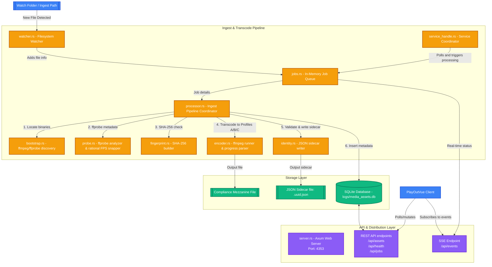

# PlayoutTranscode

PlayoutTranscode is the upstream media ingestion, analysis, and preparation service. It is designed to run as a background service on Windows, monitoring ingestion paths, normalizing source files into broadcast-compliant, frame-accurate progressive/interlaced mezzanine streams, and publishing structured metadata for consumption by the downstream **PlayOutVue** client.

---

## Architecture & Data Flow

Below is the flow of media and metadata within the `PlayoutTranscode` system, starting from filesystem detection to REST and SSE API publication.



---

## Core Features

1. **Active Folder Watching**: Monitors folders for incoming file additions. Settles files to avoid processing during copy/write.
2. **Rational FPS Snapping**: Extracts metadata via `ffprobe` and snaps frame rates to exact broadcast rationals (e.g. `25/1`, `30000/1001`, `24000/1001`) instead of float approximations.
3. **FFmpeg Ingestion Engine**: Transcodes files into compliance profiles A/B/C using `libx264`, constant frame rate (CFR), closed GOP, faststart, and 48 kHz stereo audio.
4. **Fingerprinting & De-duplication**: Uses SHA-256 hashing to check files for duplicate content, preventing redundant transcoding jobs.
5. **Mezzanine Contract Validation**: Enforces that no asset is marked `ready` in the database unless it conforms to the strict playback requirements of the downstream player.
6. **Sidecar Identity Metadata**: Writes `.uuid.json` sidecar files containing stable media definitions.

---

## Ingest Encoding Profiles

| Profile | Output Specs | Color Space | Interlacing | Intended Use |
|---|---|---|---|---|
| **Profile A** | 1920x1080 | BT.709 | Progressive (CFR) | HD progressive distribution |
| **Profile B** | 1920x1080 | BT.709 | Interlaced (TFF) | HD broadcast transmission |
| **Profile C** | 1920x1080 (pillarboxed) | SMPTE 170M | Progressive (CFR) | SD 4:3 legacy conversion |

---

## API Surface

- `GET /api/health`: Health check endpoint.
- `GET /api/assets`: List all registered ready assets.
- `GET /api/assets/{uuid}`: Fetch detailed metadata for a specific asset.
- `POST /api/assets/{uuid}/trim`: Update non-destructive trim points.
- `POST /api/assets/{uuid}/rating`: Update compliance rating/descriptors.
- `GET /api/jobs`: List transcode job history.
- `GET /api/events`: Event stream (SSE) emitting real-time status updates (`Pending`, `Processing`, `Completed`, `Failed`).

---

## Build and Run

### Build Service
Ensure you have the Rust toolchain installed:
```powershell
cargo check
cargo build --release
```

### Run Service
```powershell
cargo run --release -- --config logs/config.toml
```

---

## Verification & Testing
Execute unit and integration tests to check transcode contracts and API boundary invariants:
```powershell
cargo test
cargo test --test contract_boundary
```
