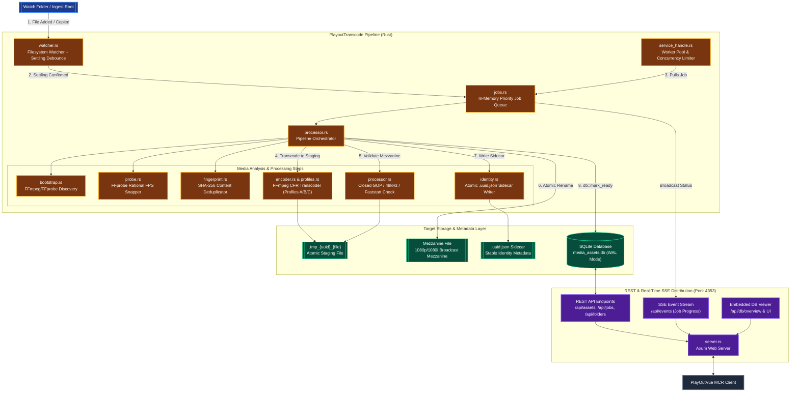

# PlayoutTranscode

[](https://github.com/Soranokuni)
[](https://opensource.org/licenses/MIT)
[](https://www.rust-lang.org/)
[](https://github.com/tokio-rs/axum)
[](https://ffmpeg.org/)
[](https://www.sqlite.org/)

**PlayoutTranscode** is an automated, broadcast-grade media ingestion, analysis, and mezzanine transcoding engine developed by **[Soranokuni](https://github.com/Soranokuni)**. Engineered in **Rust** as a resilient Windows service daemon, it monitors watch folders, performs rational FPS snapping, normalizes incoming media into standardized frame-accurate mezzanine streams (Profiles A/B/C), writes JSON identity sidecars, and exposes a high-performance REST and Server-Sent Events (SSE) API to downstream clients like **[PlayOutVue](https://github.com/Soranokuni/PlayOutVue)**.

---

## Architecture & Ingest Pipeline

The pipeline guarantees zero partial-read hazards through atomic `.tmp` staging, strict FFprobe validation, and deferred database publication.



---

## Core Ingestion Features

1. **Active Settling & Debounce**: Detects file writes across network and local filesystems, applying file-settling heuristics to avoid reading partial files during copy operations.
2. **Rational FPS Snapping**: Snaps probed frame rates to exact broadcast rationals (e.g. `25/1`, `30000/1001`, `24000/1001`, `60000/1001`) instead of lossy float approximations.
3. **Deterministic Transcoding**: Uses `libx264`, constant frame rate (CFR), 2.0-second closed GOPs, faststart `moov` atom placement, and 48 kHz stereo audio resampling.
4. **Zero Partial-Read Staging**: Encodes media directly into temporary files (`.tmp_{uuid}_{filename}`) on the target volume and atomically renames them only after complete validation.
5. **Mezzanine Contract Enforcement**: Never calls `db::mark_ready` until duration, closed GOP, audio rate, faststart header, and sidecar JSON are verified.
6. **Soft-Delete Recycle Bin & Reference Checking**: Allows soft-deleting media into a recycle bin, preventing physical deletion of assets that are actively scheduled in broadcast rundowns.
7. **Process Priority & Concurrency Throttling**: Limits simultaneous FFmpeg processes and sets OS thread priorities to `Below-Normal` to ensure playout machines remain responsive.

---

## Broadcast Encoding Profiles

PlayoutTranscode provides three standard broadcast profiles configurable in `config.toml`:

| Profile | Target Resolution | Scan Type | Color Matrix | FFmpeg Flags | Typical Use Case |
|---|---|---|---|---|---|
| **Profile A** | 1920x1080 | Progressive (CFR) | BT.709 | `-c:v libx264 -pix_fmt yuv420p -movflags +faststart` | HD progressive transmission & digital master |
| **Profile B** | 1920x1080 | Interlaced (TFF) | BT.709 | `-c:v libx264 -flags +ilme+ildct -top 1 -pix_fmt yuv420p` | HD 1080i broadcast playout |
| **Profile C** | 1920x1080 (pillarbox) | Progressive (CFR) | SMPTE 170M | `-vf "scale=1440:1080,pad=1920:1080:(ow-iw)/2:(oh-ih)/2"` | SD 4:3 archive upconversion |

### Common Stream Properties (All Profiles)
- **Video Codec**: `libx264` (CRF-based, closed GOP: 50 frames @ 25fps / 60 frames @ 29.97fps)
- **Audio Codec**: AAC / PCM stereo at **48,000 Hz** (broadcast standard)
- **Container**: MP4 with faststart enabled (`moov` atom at file beginning)

---

## API Surface

PlayoutTranscode exposes a RESTful API and SSE stream on port `4353`:

### Asset & Media Management
- `GET /api/assets`: List all registered, playable mezzanine assets.
- `GET /api/assets/{uuid}`: Retrieve detailed metadata for a specific asset.
- `PUT /api/assets/{uuid}/trim`: Update non-destructive in/out trim points (`trim_in_ms`, `trim_out_ms`).
- `PUT /api/assets/{uuid}/rating`: Update Greek NCRTV age rating (`K`, `8`, `12`, `16`, `18`) and timed advisory banner.
- `PUT /api/assets/{uuid}/tp`: Update Product Placement (`TP`) status.
- `POST /api/assets/{uuid}/subclip`: Create a virtual subclip without duplicating physical media.
- `POST /api/assets/{uuid}/trash`: Soft-delete an asset to the Recycle Bin.
- `POST /api/assets/{uuid}/restore`: Restore an asset from the Recycle Bin.
- `DELETE /api/assets/{uuid}/purge`: Permanently delete an asset from disk (reference-checked).
- `POST /api/assets/{uuid}/regenerate-sidecar`: Re-export `.uuid.json` metadata sidecar.

### Folders & Recycle Bin
- `GET /api/folders/colors`: Get color tags for virtual folder trees.
- `PUT /api/folders/colors`: Set folder color metadata.
- `POST /api/folders/trash`: Soft-delete an entire virtual folder tree.
- `POST /api/folders/restore`: Restore a trashed folder tree.
- `DELETE /api/folders/purge`: Permanently purge a trashed folder tree.
- `GET /api/recycle-bin`: List all trashed assets and folders.
- `DELETE /api/recycle-bin/purge`: Empty the Recycle Bin.
- `POST /api/recycle-bin/auto-purge`: Trigger background cleanup of expired trash items.

### Job Engine & Real-Time Monitoring
- `GET /api/jobs`: List transcode job history.
- `GET /api/jobs/active`: List currently running transcode jobs.
- `GET /api/jobs/pending`: List queued jobs waiting for execution.
- `GET /api/jobs/failed`: List failed jobs with error logs.
- `POST /api/jobs/{id}/retry`: Retry a failed job.
- `POST /api/jobs/{id}/cancel`: Cancel an active or pending job.
- `GET /api/events`: Server-Sent Events (SSE) stream emitting real-time job progress and completion events.

### System & Diagnostics
- `GET /api/health`: Service health, uptime, and database status.
- `GET /api/toolchain`: Probed status of `ffmpeg` and `ffprobe` binaries.
- `GET /api/config`: Read current runtime configuration.
- `PUT /api/config`: Update and reload configuration dynamically.
- `GET /api/diagnostics`: Export diagnostic package for troubleshooting.
- `GET /api/db/overview`: Embedded database viewer and table row counts.

---

## Configuration (`config.toml`)

```toml
[server]
port = 4353
bind_address = "0.0.0.0"

[paths]
watch_folder = "D:/Media/Ingest"
target_folder = "D:/Media/Mezzanine"
database_path = "D:/PlayoutTranscode/logs/media_assets.db"

[transcode]
default_profile = "ProfileA"
max_concurrency = 2
process_priority = "BelowNormal"
settling_delay_seconds = 5

[cleanup]
auto_purge_days = 30
verified_source_cleanup = false
```

---

## Build & Run

### 1. Build from Source
Ensure Rust toolchain `1.77.2+` is installed:
```powershell
cargo check
cargo build --release
```

### 2. Run Interactively
```powershell
cargo run --release -- --config config.toml
```

### 3. Run Automated Contract Tests
Verify contract boundary invariants against PlayOutVue:
```powershell
cargo test
cargo test --test contract_boundary
```

---

## Author & Project Information

- **Author**: **[Soranokuni](https://github.com/Soranokuni)** (Alex Fountas)
- **Email**: [shadowsora13@hotmail.gr](mailto:shadowsora13@hotmail.gr)
- **Repository**: [https://github.com/Soranokuni/PlayoutTranscode](https://github.com/Soranokuni/PlayoutTranscode)

---

## License

This project is licensed under the **MIT License**.
